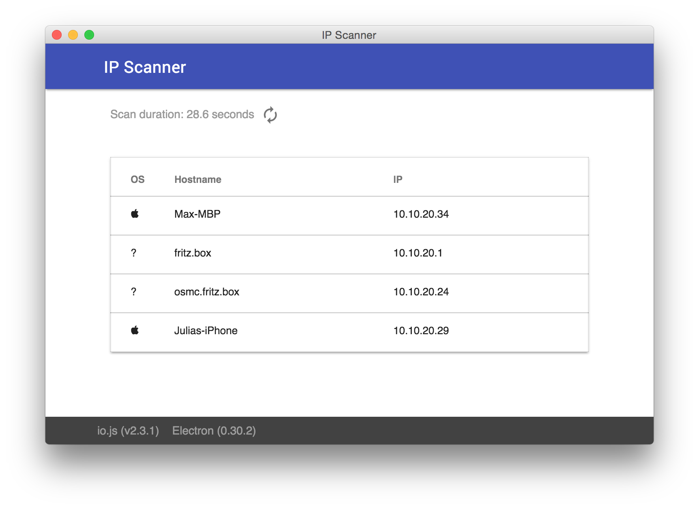

### IP Scanner

IP Scanner built with [electron](https://github.com/atom/electron), [node-libnmap](https://github.com/jas-/node-libnmap) and [material-design-lite](https://github.com/google/material-design-lite).

<h1 align="center">
  <br>
  
  <br>
  <br>
  <br>
</h1>

#### Installation

Install [electron](https://github.com/atom/electron)

```
npm install -g electron
```

Install dependencies

```
npm install & bower install
```

#### Usage

Run electron in the root directory

```
electron .
```